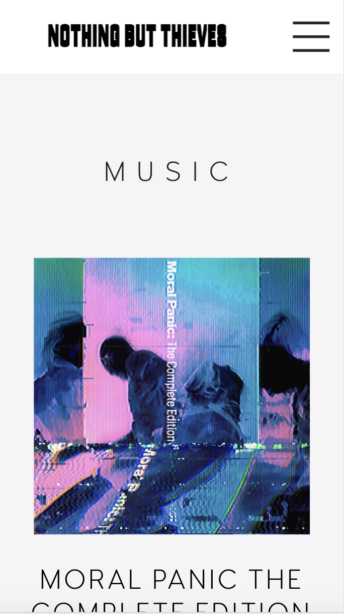
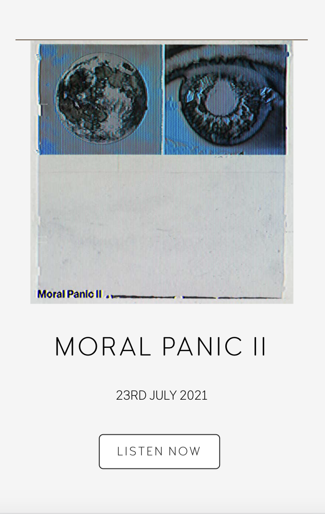
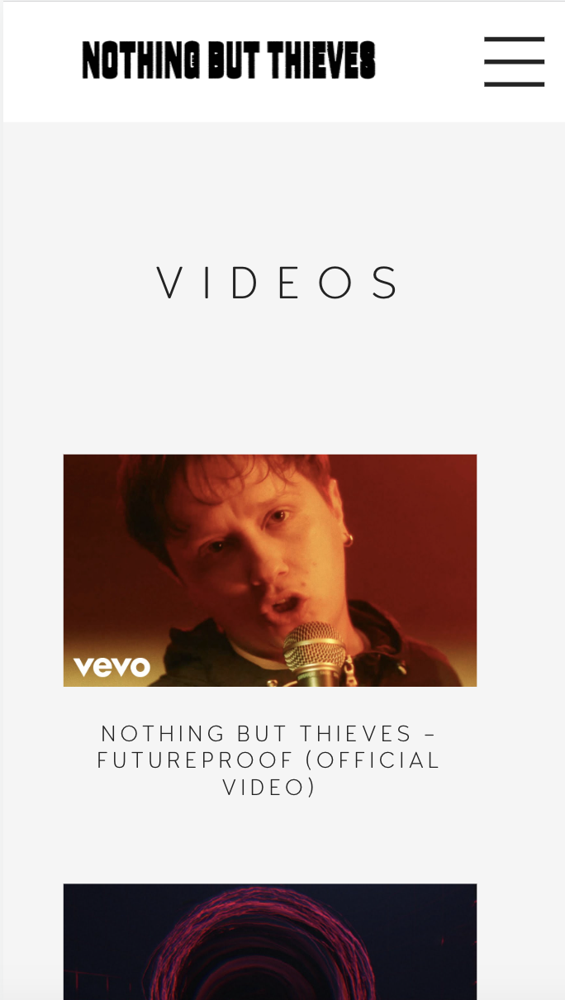
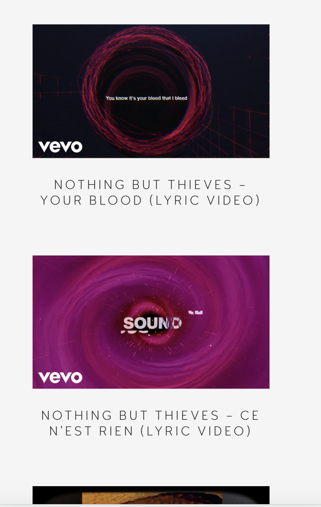
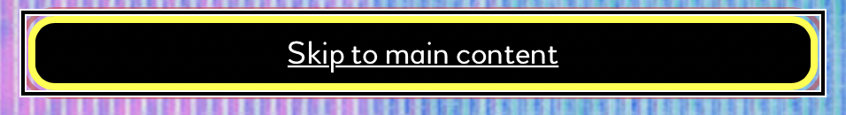
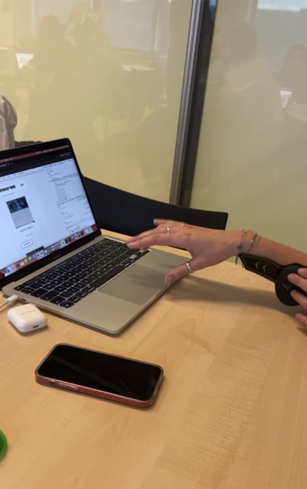
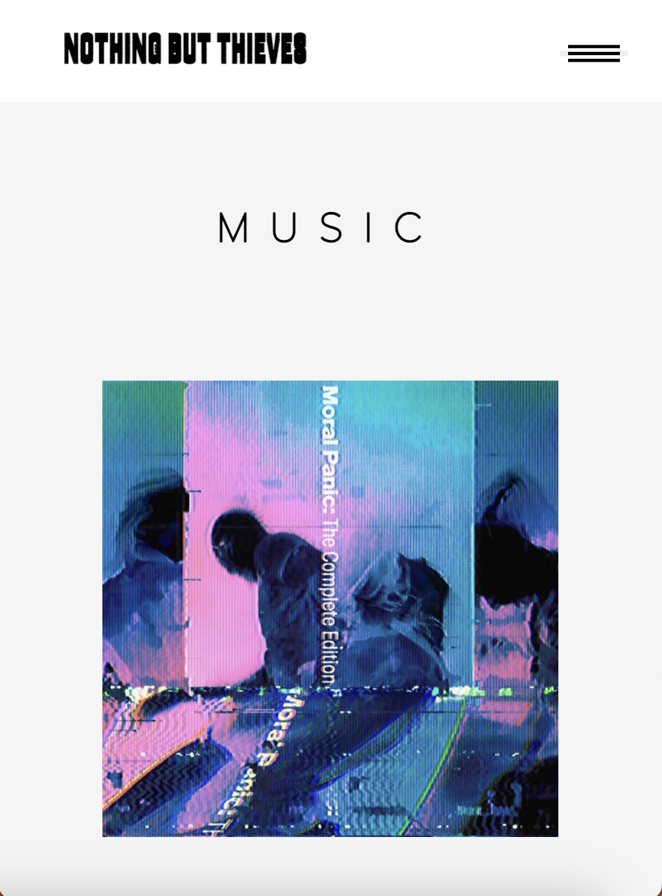
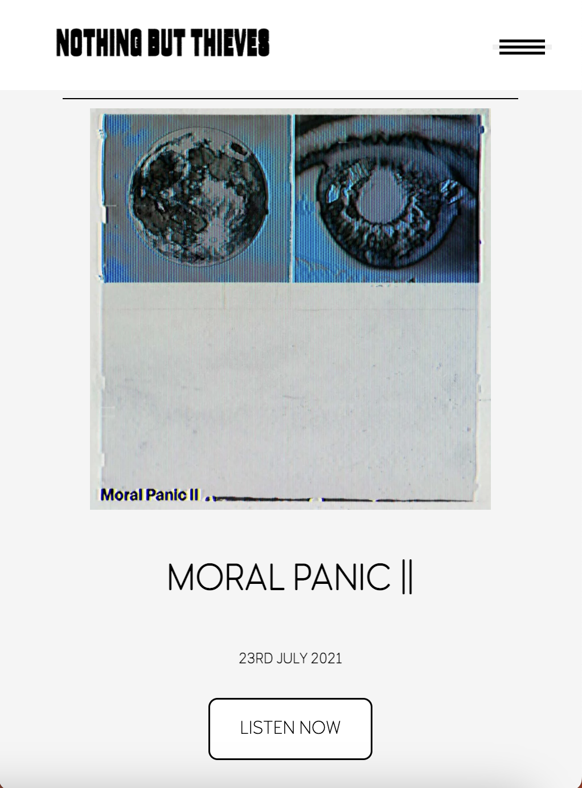
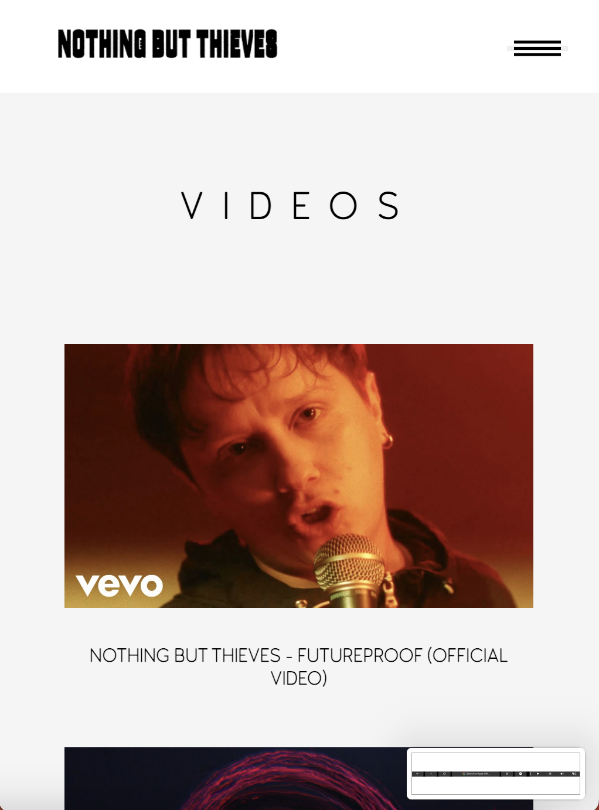
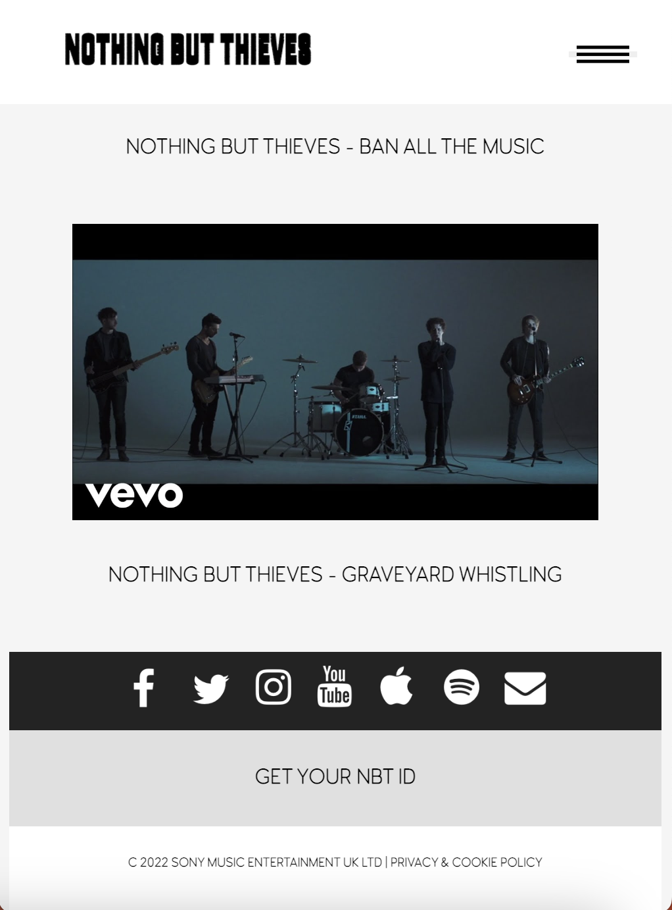

# Procesverslag
Markdown is een simpele manier om HTML te schrijven.  
Markdown cheat cheet: [Hulp bij het schrijven van Markdown](https://github.com/adam-p/markdown-here/wiki/Markdown-Cheatsheet).

Nb. De standaardstructuur en de spartaanse opmaak van de README.md zijn helemaal prima. Het gaat om de inhoud van je procesverslag. Besteedt de tijd voor pracht en praal aan je website.

Nb. Door *open* toe te voegen aan een *details* element kun je deze standaard open zetten. Fijn om dat steeds voor de relevante stuk(ken) te doen.

## Jij

  
uitwerken voor kick-off werkgroep

  ### Auteur:
Kelly Mae Brugman
  #### Je startniveau:
Blauw
  #### Je focus:
Surface plane 

## Je website

  
uitwerken voor kick-off werkgroep

  ### Je opdracht:
https://www.nbthieves.com

  #### Screenshot(s) van de eerste pagina (small screen): 
  Music pagina Nothing But Thieves 

  
  

  #### Screenshot(s) van de tweede pagina (small screen):
  Video pagina Nothing But Thieves

  
  
 

## Toegankelijkheidstest 1/2 (week 1)

  
uitwerken na test in 1e werkgroep

  ### Bevindingen
  Lijst met je bevindingen die in de test naar voren kwamen:

  #### Screenreader
  Wanneer de de screenreader aanzet krijg je als eerst dit in beeld te zien:
  
  En wanneer je hier overheen tabt ga je gelijk van de hele website af en gaat hij tabben naar andere dingen die ook in beeld zijn.
  Dit is niet handig omdat je eerst op die knop moet klikken om verder te gaan in de website.

  #### Muis en Toetsenbord 
  Wanneer je met je pijltje naar beneden klikt dan gebeurt er een soort glitch. Hij doet namelijk alsof hij naar beneden wilt maar schiet gelijk daarna weer naarboven toe.
  Verder gebeurt er helemaal niets als je gaat tabben zonder de screenreader aan.

  #### Motoriek (shocks, elastiekjes)
  Hier hebben we in de eerste week nog niets mee gedaan.

  #### Visueel (brillen, contrast, kleurenblind, dark/light). 
  Wanneer je de website op darkmode zet gebeurt er precies niks. Die is dus niet gemaakt. Dit is iets wat ik zou kunnen toevoegen om de website toegankelijker te maken.

## Breakdownschets (week 1)

  
uitwerken na afloop 2e werkgroep

  ### de video pagina: 
  

  ### de music pagina: 
  

## Voortgang 1 (week 2)

  
uitwerken voor 1e voortgang

  ### Stand van zaken
  hier dit ging goed & dit was lastig (neem ook screenshots op van delen van je website en code)

  ### Agenda voor meeting
  samen met je groepje opstellen

  | student 1 - Lizzy| student 2 - Bahaa  | student 3 - Kelly Mae 
  | ---              | ---                | ---                   
  | dit bespreken    | en dit             | Hoe kan ik een video toevoegen in mijn html?       
  | en dat ook nog   | dit als er tijd is | Waarom linkt mijn css niet op beide pagina's?
  | ...              | ...                | Hoe zorg ik ervoor dat mijn header als hamburgermenu krijg?

  ### Verslag van meeting
  hier na afloop snel de uitkomsten van de meeting vastleggen

  - Nina heeft mij geholpen met het toevoegen van een video in mijn website.

## Voortgang 2 (week 3)

  
uitwerken voor 2e voortgang

  ### Stand van zaken
  Tijdens deze voortgang heb ik mijn website laten zien aan de docent waarop hij mij feedback kon geven.
  Hier hebben wij besproken hoe ver ik was en wat ik nog moet doen.

  Er waren een aantal dingen die niet lukten bij mij waar ik hulp om heb gevraagd zoals bijvoorbeeld de menubalk die zich heel raar gedraagde.
  Ook had ik een vraag over hoe ik de footer zou moeten maken. (hoe moet de opmaak eruit zien in de html, hoe moet ik het maken)

  ### Verslag van meeting
  Aan het einde van het gesprek wist ik weer een beetje welke kant ik op moet gaan als het gaat om voortgang en welke dingen er sowiezo nog moeten gebeuren om een voldoende te halen.

  Hierna heeft Eva (studentassistent) mij ook nog geholpen met een paar kleine dingen.

## Toegankelijkheidstest 2/2 (week 4)

  
uitwerken na test in 8e werkgroep

  ### Bevindingen
  Lijst met je bevindingen die in de test naar voren kwamen (geef ook aan wat er verbeterd is):

  #### Screenreader
  Door voor de tweede keer met de screenreader door de pagina heen te gaan ben ik achter een aantal dingen gekomen.
  Bij het navigeren door de music pagina heen stopt hij bij elk visueel onderdeel. Hij noemt zelfs de streepjes op waar je langs komt, dit is natuurlijk niet heel erg handig.

  #### Muis en Toetsenbord 
  Iets wat mij hier heel erg opviel is dat je niet door het menu heen kan tabben. Hij skipt het volledig en je kunt ze niet selecteren. Dit is iets wat ik zeker wil gaan toevoegen want op deze manier maak je het een stuk toegankelijker.

  #### Motoriek (shocks, elastiekjes)
  
  Tijdens het doen van de schocktest kwam ik heel eerlijk gezegd niet achter heel veel nieuwe dingen. Wel dat het irritant is als het gaat om navigeren maar dat is meer dan normaal denk ik dan maar. Je kan hier niet heel veel aan veranderen ben ik bang want je kunt de knoppen wel heel groot gaan maken maar dat heeft natuurlijk niet zoveel zin want dan ziet de hele website er niet meer uit en is de navigatie ook niet echt verantwoord meer.

  #### Visueel (brillen, contrast, kleurenblind, dark/light). 
  We hebben veel met brillen kunnen doen om te kijken wat er gebeurd als je visueel beperkt bent. En iets waar ik achter ben gekomen is dat het best slim is om een dark mode toe te voegen. dit om het contrast te vergroten en voor mensen die gevoelig zijn voor licht. Want de website van zichzelf is heel erg wit en fel, dus om die reden kun je het best wat donkerder maken.

## Voortgang 3 (week 4)

  
uitwerken voor 3e voortgang

  ### Stand van zaken
  Tijdens de derde voortgang moesten wij weer de site laten zien op het grote scherm om de laatste paar dingen af te spreken van wat er nog moet gebeuren om het te laten voldoen aan de surface plane en hoe ik het nog toegankelijker kan maken.

  Hierbij hebben wij afgesproken om de volgende dingen van de surface plane toe te voegen:
  - Menu tab baar maken
  - Animatie in het menu
  - Dark mode
  - Hover op de button
  - Fixed header

  ### Verslag van meeting
  Na afloop kwam het er op neer dat ik goed opweg ben maar dat er nog een aantal dingen moeten gebeuren als het gaat om styling en toegankelijkheid.

## Eindgesprek (week 5)

  
uitwerken voor eindgesprek

  ### Je uitkomst - karakteristiek screenshots:
  
  
  
  

  ### Dit ging goed/Heb ik geleerd: 
  Ik heb dit blok heel erg veel geleerd:
  Door de lessen is er weer heel veel terug gekomen van vorig jaar en heb ik ook veel dingen erbij geleerd. 
  Het was fijn om een website na te kunnen maken omdat je zo niet op de content hoeft te letten.
  Dit zijn een aantal dingen die ik heb geleerd tijdens dit vak door de lessen en door de studentassistenten:
  - Het toevoegen van een video met een thumbnail
  - Het laten afspelen van een video door er op te klikken, en ook weer op pauze te zetten
  - Het maken van een menu
  - Het maken van een animatie die veranderd door er op te klikken
  - Het maken van een dark mode
  - het gebruik maken van nth-of-type om bepaalde dingen aan te spreken zonder classes te gebruiken

  ### Dit was lastig/Is niet gelukt:
  Er waren heel erg veel dingen die ik lastig vond. Alle dingen hierboven waren ook niet gelukt al had ik niet de hulp gekregen van de docent, en van de twee studentassistenten. Ook mijn klasgenoten waren heel erg behulpzaam waardoor het soms voelde als een groepsproject omdat ik niet alles zelf heb geschreven. Maar ondanks dat ik niet alles zelf heb geschreven, kan ik het grootste deel wel uitleggen en ik snap wat er staat. En ik denk dat dit het belangrijkste van het vak was.

## Bronnenlijst

  
continu bijhouden terwijl je werkt

  1. Nina Vens
  2. Eva Boogaard
  3. Bahaa Salaymeh
  4. Berry Nieskens

